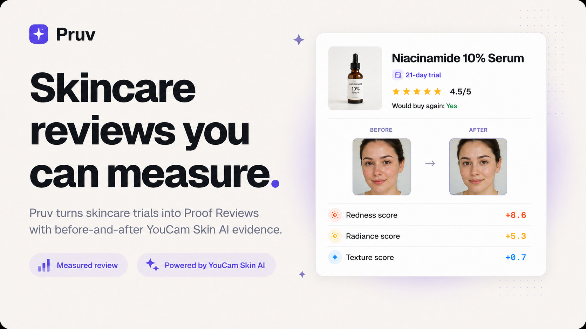
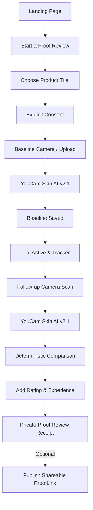
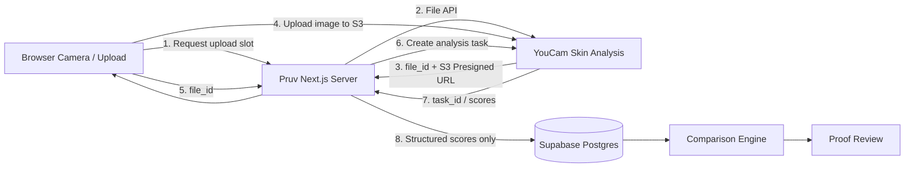
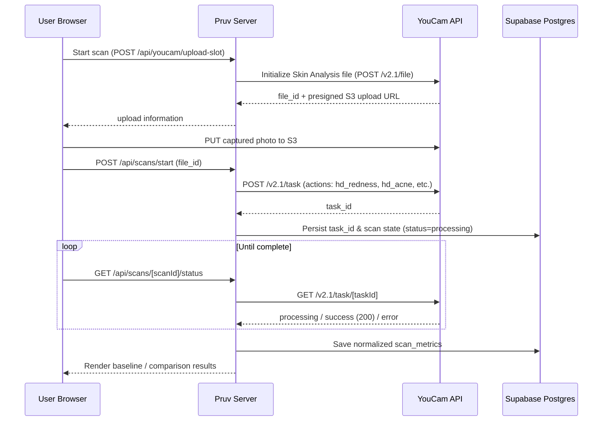
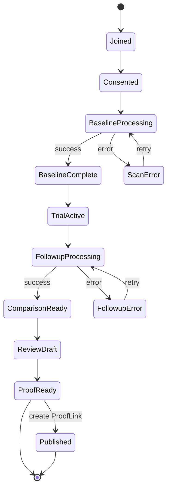
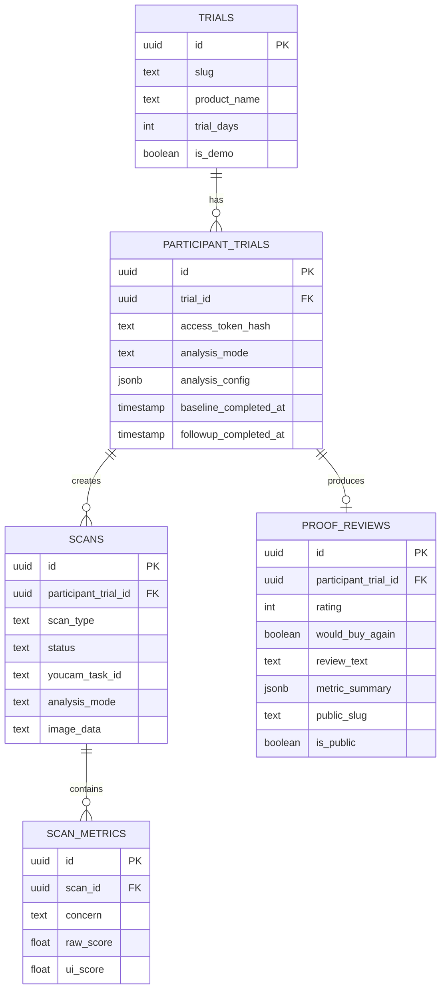

# ✦ Pruv

### Skincare reviews you can measure.

> Turn a skincare product trial into a measured review backed by before-and-after YouCam AI Skin Analysis.

Capture a baseline, use the product normally, return for a follow-up, and combine observed YouCam Skin AI changes with your own rating and experience.

**The result is a Proof Review: opinion + measured change in one verified artifact.**

[Live Demo](https://pruv.vercel.app) · [GitHub Repository](https://github.com/NikhilRaikwar/Pruv) · [MIT License](./LICENSE)

<br/>

<p align="center">
  
</p>

---

## 💡 Why Pruv?

People spend weeks testing skincare products, but most online reviews still say only whether someone *liked* a product:

### A normal skincare review
> ★★★★★ — “Loved it, worked great for me!”

### A Pruv Proof Review
- **21-day trial**
- **★★★★☆ (4 / 5)**
- **Would buy again**: Yes
- **Redness score**: `+8.6`
- **Radiance score**: `+5.3`
- **Texture score**: `+0.7`
- **Measured with YouCam Skin AI v2.1**

---

## 🚀 How It Works

1. **Start a Proof Trial** — Choose the skincare product and target duration.
2. **Capture a baseline** — YouCam Skin Analysis measures the starting point across 5 dimensions.
3. **Use the product normally** — The trial session persists securely.
4. **Take a follow-up scan** — Pruv repeats the exact same measurement contract.
5. **Compare the measurements** — Pruv calculates deterministic mathematical deltas.
6. **Add your experience** — Star rating, would-buy-again choice, and observational quote.
7. **Create a Proof Review** — Opinion + measured change become one tamper-proof receipt with public ProofLink and printable PDF download.

---

## 🧭 User Flow



---

## 🪄 Why YouCam Skin Analysis?

Pruv is not using Skin AI as a one-time gimmick or generic photo scanner.

YouCam provides the **measurement primitive** for a true longitudinal review:
- The baseline establishes an **immutable measurement contract**.
- The follow-up reuses the **same metric family** under identical framing.
- Pruv stores the structured measurements.
- Pruv computes the change deterministically.
- The final review combines those measurements with the user's authentic experience.

### Shipped Metric Family (YouCam Skin Analysis v2.1 HD):
- 🔴 **Redness & Erythema** (`hd_redness`): 0–100 health score
- 🟡 **Radiance & Luminosity** (`hd_radiance`): 0–100 health score
- 🔵 **Texture Smoothness** (`hd_texture`): 0–100 health score
- 🟣 **Acne & Blemishes** (`hd_acne`): 0–100 health score
- 🪻 **Pores Visibility** (`hd_pore`): 0–100 whole-face health score

---

## 🏗️ System Architecture



---

## ⚡ Real YouCam Request Sequence



---

## 🔄 Trial State Machine



---

## 📊 Data Model (Entity-Relationship)



---

## 📐 Measurement Consistency & Comparison Engine

A before/after comparison is only meaningful when both scans use the same measurement configuration:
- When a baseline succeeds, Pruv locks its analysis contract (YouCam v2.1 HD family and actions).
- The follow-up scan must reuse the identical contract.
- Score changes are **deterministic mathematical calculations**, never hallucinations:

$$\Delta = \text{Followup Score} - \text{Baseline Score}$$

---

## 🛡️ Privacy by Design

- **Explicit Prior Consent**: Camera streams and uploads require explicit user agreement.
- **Transient Face Uploads**: Raw uploads go straight to YouCam's secure presigned S3 endpoint.
- **Anonymous Sessions**: Participant sessions use cryptographic random cookies whose SHA-256 hash is verified server-side without collecting emails or passwords.
- **Private by Default**: Reviews stay private until the user explicitly clicks "Create ProofLink".
- **Medical Disclaimer**: Clear labeling that measurements are personal observational metrics, not clinical medical diagnoses.

---

## 🛠️ Environment Configuration

| Variable | Required | Scope | Purpose |
| :--- | :--- | :--- | :--- |
| `YOUCAM_API_KEY` | **Yes** | Server | Authenticates with Perfect Corp. YouCam API |
| `YOUCAM_BASE_URL` | **Yes** | Server | YouCam API endpoint (`https://yce-api-01.makeupar.com`) |
| `SUPABASE_URL` | **Yes** | Server | Supabase PostgreSQL project URL |
| `SUPABASE_SECRET_KEY` | **Yes** | Server | Supabase Service Role Secret Key |
| `OPENROUTER_API_KEY` | No | Server | Narrative synthesis assistant (optional) |
| `APP_SECRET` | **Yes** | Server | Session token signing secret |
| `NEXT_PUBLIC_APP_URL`| **Yes** | Client/Server | Canonical web application URL |

---

## 🧪 Testing & Verification

```bash
# Run complete test suite (100% pass rate)
npm test

# Run linter
npm run lint
```

### How we verified the YouCam integration:
During development, we connected official YouCam Model Context Protocol (MCP) tooling:
1. Checked Skin Analysis feature costs (`Get-Feature-Cost`).
2. Inspected presigned upload slot behavior (`Get-Upload-API-Info`).
3. Ran live Skin Analysis on consented photos (`AI-Skin-Analysis`).
4. Monitored async status polling until status 200 (`Get-Running-Task-Status`).
5. Extracted verified payloads into Vitest test fixtures (`test/fixtures/youcam-hd-success.json`).

---

## 🚀 Running Locally

```bash
# 1. Clone repository
git clone https://github.com/NikhilRaikwar/Pruv.git
cd Pruv

# 2. Install dependencies
npm install

# 3. Setup environment
cp .env.example .env.local

# 4. Start local development server
npm run dev
```

Open [http://localhost:3000](http://localhost:3000) in your browser.

---

## 🌟 Why This Is More Than a Wrapper

A one-call wrapper ends when an API returns a number. **Pruv begins there:**
- Longitudinal state & trial lifecycles
- Anonymous cryptographic persistence
- Locked measurement contracts across 21 days
- Dual YouCam vision observations
- Deterministic score delta engine
- User rating & qualitative synthesis
- Verified Proof Review artifact & printable receipts
- Shareable public ProofLinks

---

## 📜 License

This project is open-source software licensed under the [MIT License](./LICENSE).

Developed with ❤️ by **Nikhil Raikwar** for the **YouCam API Skin AI & Apparel VTO Hackathon**.
