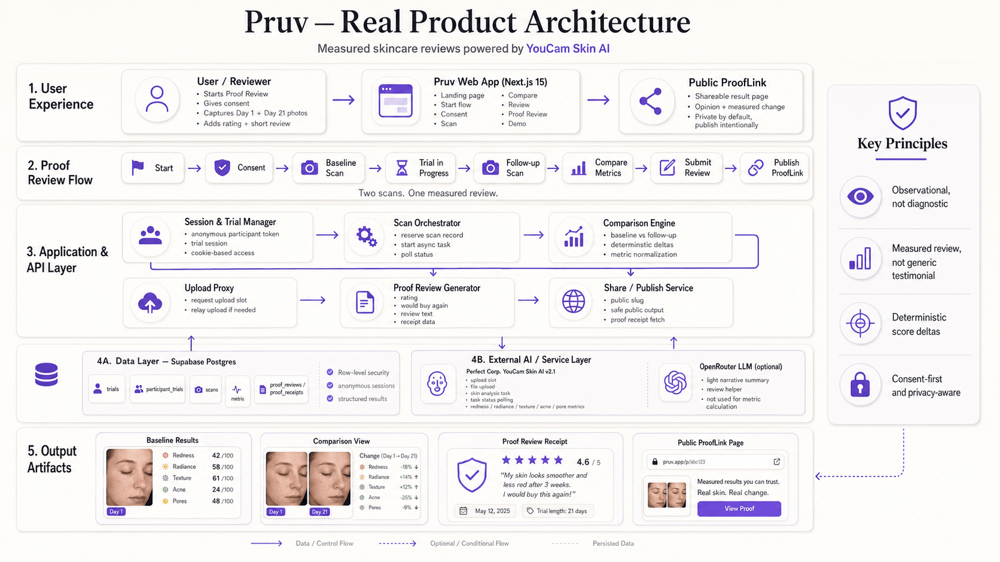

<p align="center">
  
</p>

<h1 align="center">✦ Pruv</h1>

<p align="center">
  <strong>Skincare reviews you can measure.</strong><br/>
  Turn a skincare product trial into a measured review backed by before-and-after YouCam AI Skin Analysis.
</p>

<p align="center">
  <a href="https://pruv.nikhilraikwar.me"><strong>Live Demo</strong></a> ·
  <a href="https://pruv.nikhilraikwar.me/demo"><strong>Interactive Judge Demo</strong></a> ·
  <a href="https://pruv.nikhilraikwar.me/film.html"><strong>48s Product Film</strong></a> ·
  <a href="https://github.com/NikhilRaikwar/Pruv"><strong>GitHub Repository</strong></a> ·
  <a href="./LICENSE"><strong>MIT License</strong></a>
</p>

<p align="center">
  
  
  
  
  
</p>

<br/>

> **The result is a Proof Review: personal experience + measured skin change in one verified artifact.**
> Capture a baseline, use the product normally, return for a follow-up scan, and combine observed YouCam Skin AI measurements with your rating and review.

---

## 💡 Why Pruv?

People spend weeks testing skincare products, but traditional online reviews rely solely on subjective opinion:

### A normal skincare review
> ★★★★★ — “Loved it, worked great for me!” *(Zero proof, unknown starting point)*

### A Pruv Proof Review
- **21-day trial**
- **★★★★☆ (4.5 / 5)**
- **Would buy again**: Yes
- **Redness score**: `+8.6`
- **Radiance score**: `+3.3`
- **Texture score**: `+0.7`
- **Measured with Perfect Corp. YouCam Skin AI v2.1**

> 💡 **Product-Agnostic Architecture**: For this hackathon demo, Pruv showcases a seeded *Niacinamide 10% Serum (21-Day Trial)* fixture so judges can test the full end-to-end flow immediately. The underlying architecture is completely product-agnostic and designed to support any skincare product (serums, moisturizers, acne treatments, retinols, and sunscreens).

---

## 🚀 How It Works

1. **Scan Your Skin** — Capture a quick baseline scan using YouCam Skin AI before starting a product.
2. **Complete Your Trial** — Use the product as recommended over your target duration.
3. **Follow-up Scan** — Return for a follow-up scan using the same capture guidance and measurement contract.
4. **Get Your Proof Review** — View deterministic score deltas, add your rating and review, and publish an optional shareable ProofLink.

---

## 🪄 Why YouCam Skin Analysis?

Pruv does not use Skin AI as a one-off scanner. YouCam provides the **measurement primitive** for an authentic longitudinal review:
- The baseline establishes a **locked measurement contract**.
- The follow-up reuses the **same metric family** under consistent capture guidance.
- Pruv computes the score differences **deterministically**.
- The final Proof Review combines structured measurements with personal user experience.

### Shipped HD Metric Family (YouCam Skin Analysis v2.1):
- 🔴 **Redness & Erythema** (`hd_redness`): 0–100 health score
- 🟡 **Radiance & Luminosity** (`hd_radiance`): 0–100 health score
- 🔵 **Texture Smoothness** (`hd_texture`): 0–100 health score
- 🟣 **Acne & Blemishes** (`hd_acne`): 0–100 health score
- 🪻 **Pores Visibility** (`hd_pore`): 0–100 whole-face health score

---

## 🏗️ System Architecture

<p align="center">
  
</p>

---

## 🌟 Why This Is More Than a Wrapper

A one-call API wrapper ends when a score is returned. **Pruv begins there:**
- **Longitudinal State**: Manages multi-week trial lifecycles and scan intervals.
- **Locked Measurement Contracts**: Guarantees baseline and follow-up use matching analysis actions.
- **Dual Vision Observations**: Compares two distinct YouCam measurements across time.
- **Deterministic Delta Engine**: Computes exact arithmetic score differences in application code.
- **Verified Review Artifact**: Merges clinical AI metrics, star rating, and user commentary into a shareable Proof Review.
- **Shareable ProofLinks**: Generates public receipts that anyone can verify.

---

## 🛠️ Tech Stack

- **Framework**: Next.js 15 (App Router), React 19, TypeScript
- **Styling**: Tailwind CSS, Vanilla CSS Design System
- **Skin AI Engine**: Perfect Corp. YouCam AI Skin Analysis v2.1 (S2S API)
- **Database**: Supabase PostgreSQL
- **Hosting**: Vercel

---

## 🛡️ Privacy by Design

- **No Signup Required**: 100% anonymous browser sessions using cryptographic tokens.
- **Explicit Prior Consent**: Clear facial processing consent before any scan.
- **Transient Face Uploads**: Images are sent directly to YouCam's secure S3 endpoint; Pruv does not persist raw face captures in its database.
- **Private by Default**: Proof Reviews remain private until the user explicitly creates a public ProofLink.
- **Observational Boundary**: Personal observational metrics, not clinical medical diagnoses.

---

## 🚀 Run Locally

```bash
# 1. Clone repository
git clone https://github.com/NikhilRaikwar/Pruv.git
cd Pruv

# 2. Install dependencies
npm install

# 3. Setup environment variables
cp .env.example .env.local

# 4. Start development server
npm run dev
```

Open [http://localhost:3000](http://localhost:3000) in your browser.

---

## 🧪 Testing

```bash
# Run unit test suite
npm test

# Run linter
npm run lint
```

---

## 📚 Technical Documentation

Want to explore the engineering depth, state machine, and API workflows?

- [System Architecture & Data Model](./docs/ARCHITECTURE.md)
- [YouCam Skin AI Integration Guide](./docs/YOUCAM_INTEGRATION.md)
- [Privacy & Data Handling](./docs/PRIVACY.md)
- [Judge Demo Guide](./docs/DEMO.md)

---

## 📜 License

This project is open-source software licensed under the [MIT License](./LICENSE).

Developed with ❤️ by **Nikhil Raikwar** for the **YouCam API Skin AI & Apparel VTO Hackathon**.
