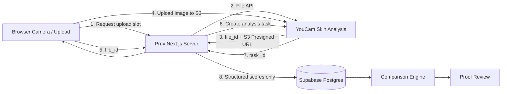
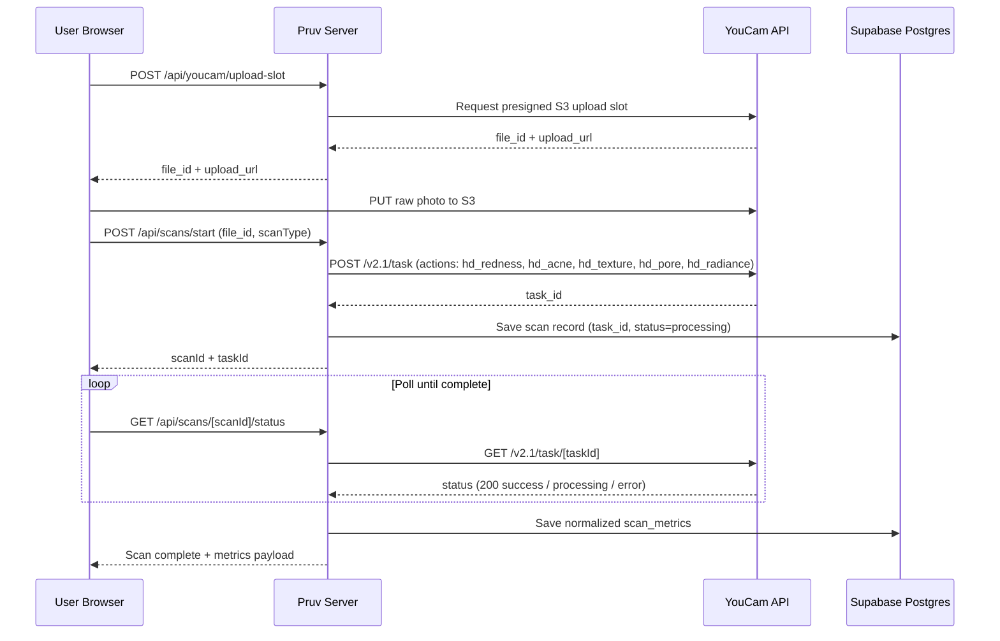
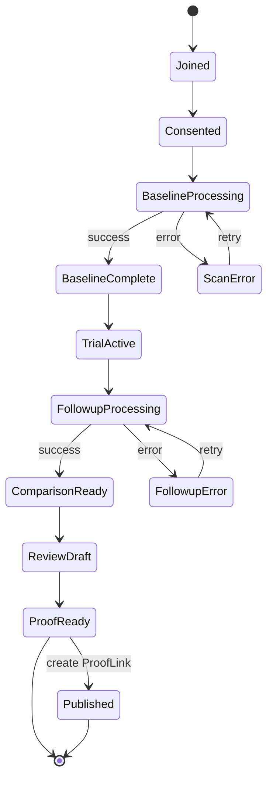
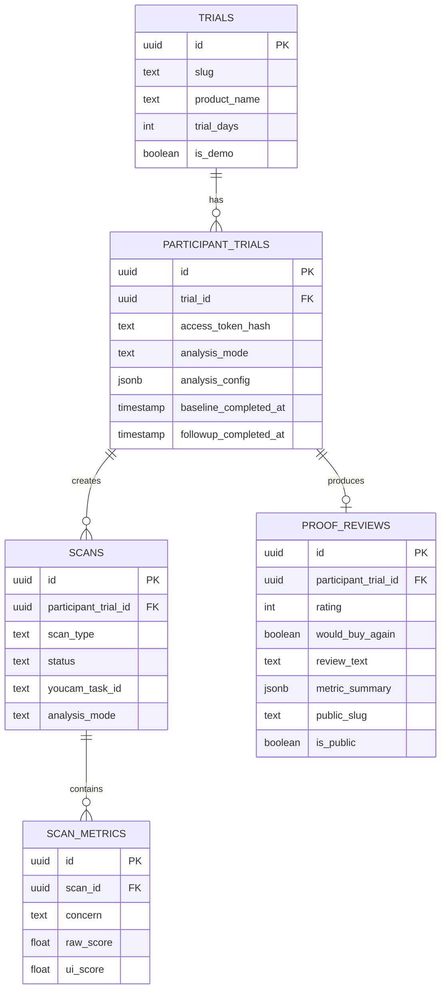

# Pruv Architecture & System Design

> Complete technical architecture, sequence diagrams, and state management for Pruv.

---

## 1. System Overview

Pruv is an end-to-end longitudinal skincare trial and review platform powered by Perfect Corp. YouCam AI Skin Analysis v2.1.

---

## 2. Real YouCam Request Sequence

---

## 3. Trial State Machine

---

## 4. Data Model (Entity-Relationship)

---

## 5. Measurement Consistency Contract

A longitudinal before/after comparison is valid only when both scans adhere to the exact same analysis family and configuration:
- **Engine Family**: Perfect Corp. YouCam Skin Analysis v2.1 HD
- **Action Set**: `hd_redness`, `hd_acne`, `hd_texture`, `hd_pore`, `hd_radiance`
- **Normalization Strategy**: 0–100 skin health scale (100 = optimal/clear skin)
- **Deterministic Delta Math**: `Followup Score - Baseline Score` (Positive = Improvement)
