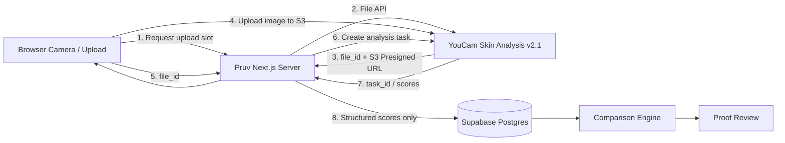
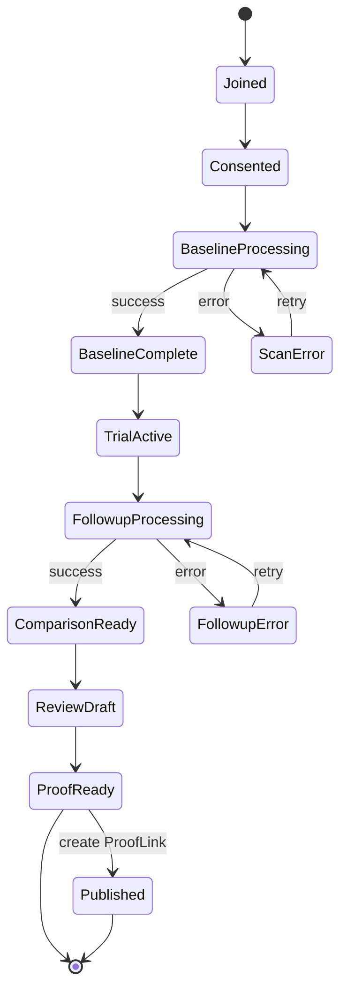
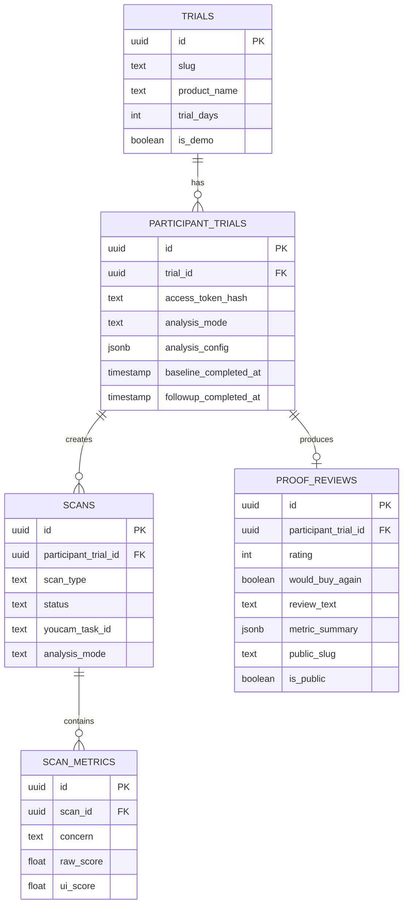

# Pruv Architecture & System Design

## Overview

Pruv turns a skincare product trial into a measured review using two Perfect Corp. YouCam Skin Analysis observations and a deterministic comparison layer.

<p align="center">
  
</p>

---

## System Architecture



---

## Product State Machine



---

## Data Model (Entity-Relationship)



---

## Measurement Contract

A before/after review is scientifically credible only when both observations adhere to an immutable measurement contract:

1. **YouCam Skin Analysis v2.1**: The baseline scan establishes the exact metric family (`hd_redness`, `hd_radiance`, `hd_texture`, `hd_acne`, `hd_pore`).
2. **Matching Follow-up Configuration**: The follow-up scan reuses the identical action set and normalized 0–100 scale.
3. **Deterministic Comparison Engine**: All numerical deltas are calculated in application code using canonical arithmetic:
   $$\Delta = \text{Followup Score} - \text{Baseline Score}$$
4. **No LLM Calculation**: Large language models do not compute or hallucinate metric values or differences.

---

## Data Flow

```text
Browser Capture
  → Pruv Server (Presigned Upload Slot Request)
  → Perfect Corp. YouCam API (File Slot Initialized)
  → Direct S3 Binary Upload (from Browser)
  → Pruv Server (Task Triggered)
  → YouCam Async Polling (until Status 200)
  → Structured Metric Normalization
  → Supabase PostgreSQL (Structured Scores Persisted)
  → Deterministic Comparison Engine (Delta Calculation)
  → User Rating & Qualitative Input
  → Private Proof Review / Optional Public ProofLink
```

---

## Persistence Architecture

Pruv separates persistent structured trial records from transient binary data:

- **Anonymous Participant**: Cryptographically random session tokens (`pruv_participant_<slug>`) whose SHA-256 hash is verified server-side without requiring passwords or emails.
- **Trial**: Product metadata, target duration, and baseline configuration.
- **Scans & Scan Metrics**: Stores task status, timestamps, and normalized 0–100 numerical scores for redness, radiance, texture, acne, and pores.
- **Proof Reviews**: Stores user star rating (1–5), buy-again preference, personal notes, metric summary snapshot, and optional public ProofLink slug.

---

## Privacy Boundaries

- **Explicit Consent**: Users affirmatively consent to facial processing before camera initialization or file upload.
- **Transient Face Uploads**: Raw images are transmitted directly to YouCam's secure S3 endpoint. Pruv does not persist raw selfie blobs in its database.
- **Structured Data Only**: Only normalized numerical scores and metadata are stored in Supabase.
- **Private by Default**: Proof Reviews remain accessible only to the trial participant until they explicitly choose to publish a shareable ProofLink.
- **Observational Boundary**: Pruv provides observational skin metrics, not medical diagnoses, dermatological prescriptions, or clinical proof of causality.
