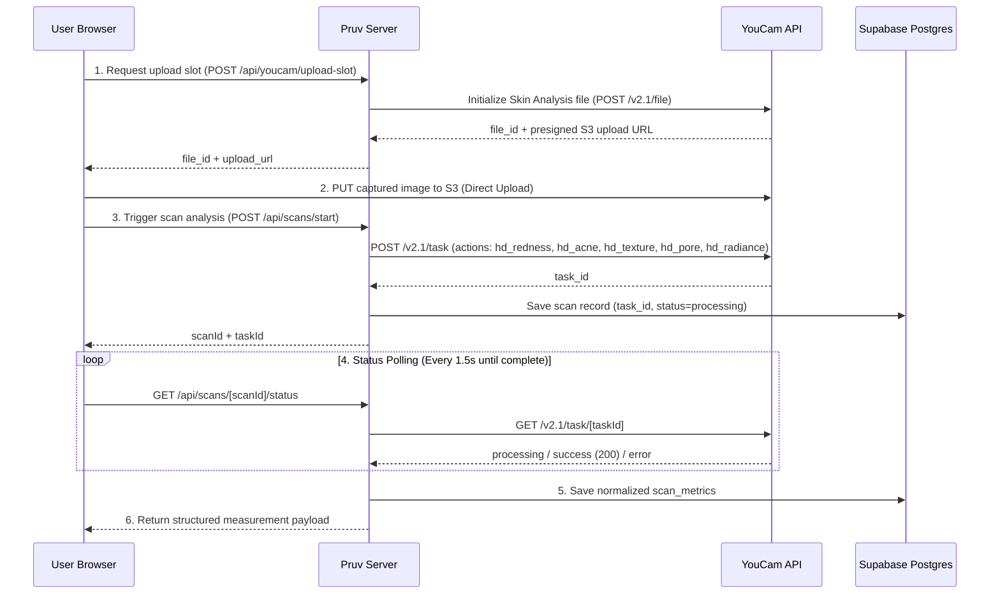

# Perfect Corp. YouCam Skin AI v2.1 Integration Guide

## API Overview

Pruv integrates directly with **Perfect Corp. YouCam AI Skin Analysis v2.1 (Server-to-Server API)** to power longitudinal before-and-after skin measurements.

- **Base URL**: `https://yce-api-01.makeupar.com`
- **Authentication**: `Authorization: Bearer <YOUCAM_API_KEY>`
- **Architecture**: 2-Step Asynchronous Direct Upload + Server Task Polling

---

## Shipped HD Metrics

Pruv measures 5 core skin health dimensions supported by YouCam AI Skin Analysis v2.1 HD:

| Metric Key | YouCam Action Key | Description | Output Scale |
| :--- | :--- | :--- | :--- |
| **Redness** | `hd_redness` | Facial erythema and redness level | 0 (Severe) – 100 (Optimal/Clear) |
| **Radiance** | `hd_radiance` | Skin luminosity, glow, and clarity | 0 (Dull) – 100 (Radiant) |
| **Texture** | `hd_texture` | Surface roughness and fine texture | 0 (Rough) – 100 (Smooth) |
| **Acne** | `hd_acne` | Active inflammatory acne and lesions | 0 (Severe) – 100 (Clear) |
| **Pores** | `hd_pore` | Pore dilation and visible pores | 0 (Enlarged) – 100 (Minimized) |

---

## Request Lifecycle



---

## Request & Response Flow

### 1. Request Presigned Upload Slot
- **Pruv Endpoint**: `POST /api/youcam/upload-slot`
- **YouCam API**: `POST /v2.1/file`
- **Response**:
```json
{
  "file_id": "bfd5f667-33a9-4e09-8fe8-62d4766bc622",
  "upload_url": "https://cyberlink-data-us.s3.amazonaws.com/yce/..."
}
```

### 2. S3 Direct Upload
- **Method**: `PUT <upload_url>`
- **Payload**: Binary JPEG photo (1280x1280 HD canvas with auto-centered face framing).

### 3. Initialize Analysis Task
- **Pruv Endpoint**: `POST /api/scans/start`
- **YouCam API**: `POST /v2.1/task`
- **Payload**:
```json
{
  "actions": [
    "hd_redness",
    "hd_radiance",
    "hd_texture",
    "hd_acne",
    "hd_pore"
  ],
  "file_id": "bfd5f667-33a9-4e09-8fe8-62d4766bc622"
}
```
- **Response**: `{ "task_id": "2096ab1e-92f8-44e2-93b3-fc961899e85c" }`

### 4. Status Polling & Metric Normalization
- **Pruv Endpoint**: `GET /api/scans/[scanId]/status`
- **YouCam API**: `GET /v2.1/task/<taskId>`
- **Metric Normalization Logic**:
  - Raw severity values from YouCam are mapped to a unified 0–100 skin health scale (where higher = healthier/clearer skin).
  - Multi-region pore items (`forehead`, `nose`, `cheek`, `whole`) are deduplicated to retain whole-face health metrics, eliminating database conflict collisions.

---

## Baseline & Follow-up Consistency

1. When a baseline scan completes, Pruv locks its analysis configuration.
2. The follow-up scan reuses the identical metric family and normalization rules.
3. Both scans use identical camera viewfinder guidance (biometric oval frame and alignment prompt).
4. Score changes are computed deterministically in application code:
   $$\Delta = \text{Followup Score} - \text{Baseline Score}$$

---

## Error Handling & Resiliency

- **Task Polling Timeout**: If a task remains in processing state beyond 45 seconds, the status endpoint returns a clear retry prompt.
- **Deduplication**: Database upserts on `scan_metrics` use composite keys `(scan_id, concern)` to prevent duplicate entries during concurrent poll requests.
- **Fail-Safe Fallback**: When API keys are unconfigured in local sandbox mode, a structured mock engine allows end-to-end interface and workflow testing.

---

## MCP Tooling Verification

During development, real YouCam API endpoints were verified using official YouCam Model Context Protocol (MCP) tooling:
1. Checked Skin Analysis feature cost (`Get-Feature-Cost`).
2. Inspected direct file upload endpoint metadata (`Get-Upload-API-Info`).
3. Performed consented image upload and triggered real YouCam task (`AI-Skin-Analysis`).
4. Monitored polling lifecycle until completion status 200 (`Get-Running-Task-Status`).
5. Extracted raw response payload into test fixtures (`test/fixtures/youcam-hd-success.json`) for automated unit tests.
